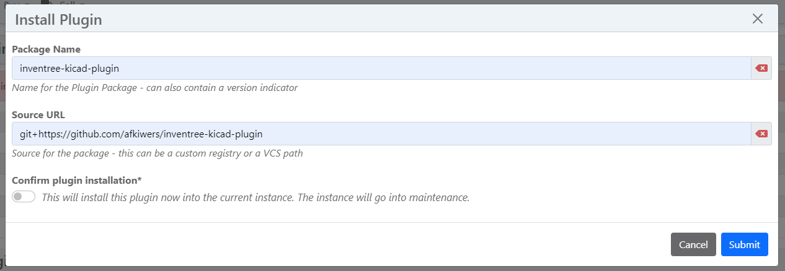
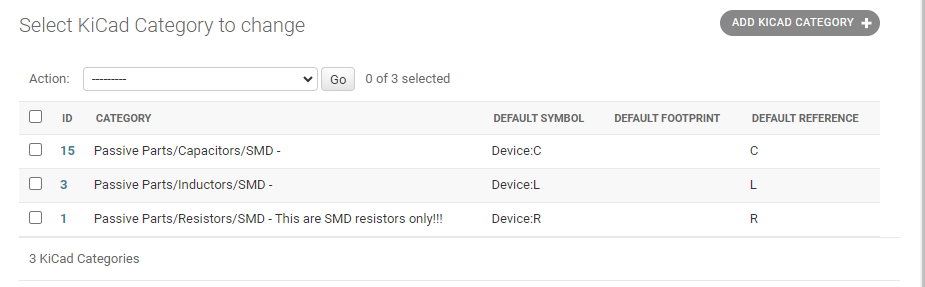
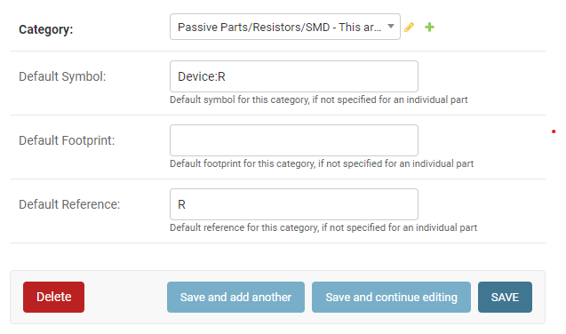
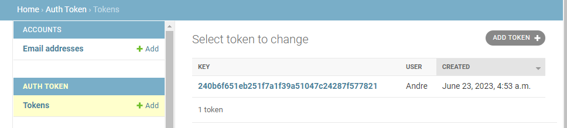

# InvenTree KiCad - HTTP Library Plugin

A KiCad Conform API endpoint plugin, designed for seamless integration with [InvenTree](https://inventree.org) , empowers users to seamlessly incorporate InvenTree parts into KiCad's parts library tool. Please note that this plugin exclusively offers metadata and necessitates the presence of corresponding symbol and footprint libraries within the KiCad EDA environment.

As of the current stage of development, KiCad exclusively offers read-only access to parts. However, it's worth noting that there are active plans and ongoing efforts to expand KiCad's functionality to include the ability to not only retrieve but also update parts stored on the server. This enhancement will further empower users to interact with and contribute to the parts database within the KiCad environment.

## Installing the Plugin
There are several methods available for installing this plugin. To gain a comprehensive understanding of the installation process, please refer to the [InvenTree - Installing a Plugin Guide](https://docs.inventree.org/en/latest/extend/plugins/install/#installation-methods). Depending on your preferred approach, the following instructions will provide you with the necessary information.

### Through GitHub
Navigate to the **Plugin Settings** and click on the Install Plugin button. This will trigger a new window to appear, prompting you to enter the following information:

- Package Name: inventree-kicad-plugin
- Source URL: git+https://github.com/afkiwers/inventree-kicad-plugin



### Through PiP
The plugin can be found here: [inventree-kicad-plugin](https://pypi.org/project/inventree-kicad-plugin/).

## Configure Plugin Settings
After installing the plugin, head over to the Plugin Settings and activate it. Look for **KiCadLibraryPlugin** in the list of available plugins. Once activated, you'll be able to open the plugin and proceed with the setup process.



## Adding Categories to KiCad
Navigate to the admin backend, and scroll down until you find the **INVENTREE_KICAD** section. Within this section, click on **KiCad Categories**.


Once opened the "KiCad Categories" model, you'll have the option to add new categories which, once added, will be visible in KiCad's Symbol Chooser dialog.


#### Default Settings for Categories
The plugin allows you to set default values when the child part lacks specific details regarding the KiCad symbol, footprint, or reference. This feature is particularly useful when dealing with components such as resistors or capacitors, as they often share the same symbols, reducing the need for repetitive data entry.



## Creating User Access Tokens
Head back to the admin backend and click on Tokens. Click on "ADD Token" to generate a token dedicated to a particular user. It is important to emphasize that it is highly advisable to create individual tokens for each user, rather than employing a single token for everyone.



## KiCad Configuration files
Below is an example config which should help you get started reasonably quickly. The only thing needed here is to replace **http://127.0.0.1:8000** with your server's InvenTree URL, and replace usertokendatastring with a valid token.
```
{
    "meta": {
        "version": 1.0
    },
    "name": "KiCad HTTP Library",
    "description": "A KiCad library sourced from a REST API",
    "source": {
        "type": "REST_API",
        "api_version": "v1",
        "root_url": "http://127.0.0.1:8000/plugin/kicad-library-plugin",
        "token": "usertokendatastring"
    }
}
```

## FAQ

### Why does this plugin need the App Mixin?

This plugin uses the App Mixin to add a custom model to the database to manage the selected categories. Otherwise, KiCad symbol chooser would be cluttered with every single category (See [Categories](#adding-categories-to-kicad))

### Why does this plugin need the Url Mixin?

This plugin uses the Url Mixin to expose custom API endpoints which are conform with KiCads REST API requirements.

